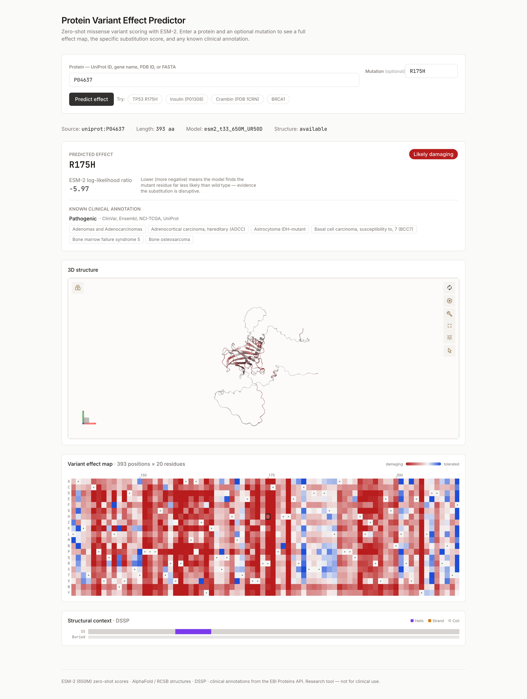

# Protein Variant Effect Predictor

Predict whether a missense mutation is damaging, using zero-shot [ESM-2](https://github.com/facebookresearch/esm)
scoring — with a full L×20 effect map, an impact-coloured 3D structure, and
clinical annotations for context.

**▶ Live demo: https://protein-variant-effect-predictor.vercel.app**

Try `TP53` / `R175H` — a hotspot mutation in the p53 DNA-binding domain.



---

## What it does

Give it a protein (UniProt accession, gene name, PDB ID, or raw FASTA) and
optionally a mutation, and it returns:

- **A score for the substitution** — the ESM-2 log-likelihood ratio
  `log P(mutant) − log P(wild-type)` at that position, with a calibrated
  damaging / uncertain / tolerated label.
- **Where that score ranks** — a raw LLR is uninterpretable on its own, so it
  is also reported against every possible substitution in the same protein:
  *"more damaging than 81% of them"*.
- **The complete mutational landscape** — every one of the 20 amino acids at
  every position, as a diverging heatmap. Conserved positions read as solid
  red bands; tolerant loops read pale. **Click any cell** to score that
  substitution — it re-reads the cached matrix, so it is instant.
- **Structure in 3D** — AlphaFold or experimental RCSB, coloured per-residue
  by predicted impact, with the mutated residue marked. The panel says which
  you are looking at, and a predicted model can be recoloured by its own
  **pLDDT confidence** — because a third of some models is low-confidence and
  should not be read as structure.
- **Structural context** — secondary structure and relative solvent
  accessibility, projected onto UniProt coordinates.
- **Clinical annotation** — ClinVar / Ensembl / UniProt / NCI-TCGA
  significance and associated diseases via the EBI Proteins API, plus
  AlphaMissense when the local dataset is present. Where submissions disagree
  the disagreement is reported, not resolved by taking the worst call.
- **A shareable link** — the URL carries the protein and mutation, so a result
  can be sent to someone rather than described.

Mistyped input is repaired rather than rejected. Ask for sickle-cell as `E6V`
and it answers *"position 6 is proline (P), not glutamic acid (E)"* and offers
**E7V** — because clinical variant names number the mature protein while this
tool uses UniProt numbering, which counts the initiator methionine. A misspelt
gene gets "did you mean" candidates.

For TP53 R175H the model returns **LLR −5.97 → likely damaging**, independently
corroborated by ClinVar's **Pathogenic** call. DSSP puts R175 at 2% relative
solvent accessibility — buried in the DNA-binding core, which is why
substituting it is destabilising.

## Results

### Does the model actually work?

Benchmarked against [ProteinGym](https://proteingym.org) deep mutational
scanning assays — Spearman correlation between the zero-shot LLR and measured
experimental fitness:

| Assay | Length | Spearman |
|---|---:|---:|
| IF1_ECOLI_Kelsic_2016 | 72 | 0.599 |
| TAT_HV1BR_Fernandes_2016 | 86 | 0.017 |
| CCDB_ECOLI_Tripathi_2016 | 101 | 0.511 |
| SUMO1_HUMAN_Weile_2017 | 101 | 0.509 |
| RL401_YEAST_Roscoe_2013 | 128 | 0.599 |
| **mean** | | **0.447** |

This sits in the range reported for ESM-2 650M (~0.41–0.44), but it is not a
like-for-like reproduction and shouldn't be read as one: published figures
average over the full ProteinGym benchmark of ~200 assays, while this is five
small ones chosen to run quickly. Five assays spanning 0.017 to 0.599 is a
wide spread, so treat the mean as indicative of the harness working, not as a
benchmark result. TAT is a viral protein, a known weak spot for protein
language models, and is left in rather than dropped to keep the average
honest.

### Where do the labels come from?

The user-facing label is a *clinical* judgement, so it is calibrated against
**AlphaMissense** pathogenicity calls, not raw DMS fitness. Bacterial and
yeast growth assays have a different LLR sensitivity and would mislabel human
variants — under DMS-derived thresholds, TP53 R175H comes out "tolerated".

Class-balanced over ~15k substitutions across 5 human proteins, targeting 90%
precision:

```
DAMAGING_LLR_THRESHOLD  = -5.50
TOLERATED_LLR_THRESHOLD = -1.33   # ~31% of variants land in the uncertain band
```

See [`benchmark/README.md`](benchmark/README.md) to reproduce either run.

### What the score can't see

The gap between a zero-shot LLR and a clinical call isn't noise. It tracks
disease mechanism, and it's worth understanding before trusting any number
here.

ESM-2 scores how ordinary a sequence looks against evolution. That makes it
strong on variants which destabilise a fold or land on a conserved active
site, and weak on variants which leave the folded protein looking
unremarkable and cause disease some other way.

Sickle-cell is the clearest example, and it's kept as a demo chip rather than
swapped for something that scores better. HBB **E7V** comes back at LLR
**−3.76**, the 37th percentile, well inside the uncertain band, while ClinVar
calls it pathogenic. The substitution puts a hydrophobic patch on the surface
which makes deoxygenated HbS polymerise into fibres. None of that is visible
to a model asking only whether a sequence is evolutionarily plausible.
Transthyretin **V50M** (clinical V30M) behaves the same way for the same
reason: amyloid formation is an aggregation phenotype, not a folding defect.

The second failure mode is sharper still. α-synuclein **A53T** causes inherited
Parkinson's, and the model scores it **+2.07** — a *positive* LLR, the 1st
percentile, "likely tolerated". It isn't a bug. Rat α-synuclein
([P37377](https://www.uniprot.org/uniprotkb/P37377)) carries threonine at
position 53 natively, so ESM-2 is right that the residue is evolutionarily
unremarkable; it is simply answering a different question from "does this cause
disease in humans". Evolutionary plausibility and human pathogenicity are not
the same thing, and A53T is the cleanest demonstration of the gap in the whole
tool.

The result page explains this wherever the model and the databases disagree, in
both directions.

## How it works

Three decisions carry most of the design:

**1. Compute once per protein, derive everything else.**
Masked-marginal scoring produces one `(L, 20)` log-probability matrix per
protein. The single-mutation score, the full heatmap, and the per-residue 3D
colouring are all cheap derivations of that one matrix. The cache key is
`(model_id, sequence_hash)` — never the mutation — so a protein is scored
exactly once per model, ever. Repeat requests never reach the GPU-shaped path
at all.

Scoring is deterministic — pinned checkpoint revision, eval mode, no sampling,
each position masked independently — so the cache is memoisation of a pure
function rather than an approximation of a fresh run. Re-scoring the same
sequence with the same model returns the same numbers. The meaningful version
of "score it again" is *a different model*, which is why `model_id` is part of
the cache key.

**2. One coordinate system.**
UniProt canonical numbering (1-based) is the single source of truth, converted
to 0-based at exactly two boundary points. This is the class of bug where a
mutation string, a scored position and a coloured residue silently disagree,
and it bites in two directions:

- *Clinical names count differently.* Sickle-cell haemoglobin is famously E6V,
  but that numbers the mature protein, after the initiator methionine is
  cleaved. Here it is **E7V**.
- *Structure files number differently again.* In PDB 1TUP the p53
  DNA-binding domain runs 1–219 by `label_seq_id` but 94–312 in UniProt, so
  colouring by the file's own numbering paints every residue with the impact
  of one 93 positions away. Residues are located by author numbering and
  mapped through [SIFTS](https://www.ebi.ac.uk/pdbe/docs/sifts/).

A protein keeps its predicted model and its experimental structures side by
side, keyed `(sequence_hash, provider)`, and which one you see follows what you
searched for. Keying on the protein alone meant one visitor resolving a PDB id
replaced the AlphaFold model for everyone.

**3. The API never imports torch.**
Inference lives behind a `Scorer` protocol with a single method:

```python
class Scorer(Protocol):
    def per_position_log_probs(self, sequence: str) -> np.ndarray: ...  # (L, 20)
```

`worker/scorers/esm2.py` is the only file in the repository that imports
torch. Adding SaProt, ESM-C, or an ensemble means writing one new class — no
caller changes. It is also a hard Docker boundary — the API image is roughly a
quarter the size of the worker's (~550MB vs ~2.2GB) and boots in seconds.

### Job dispatch is pluggable

The worker has two transports sharing one scoring core, because development
and production want opposite things:

| | Transport | Model lifetime | Used for |
|---|---|---|---|
| `worker/main.py` | ARQ, **pulls** from Redis | warm forever | local dev |
| `worker/http_app.py` | HTTP `POST /score`, **pushed** by Cloud Tasks | per instance | production |

Cloud Run only allocates CPU while a request is in flight, so a queue-polling
worker can never scale to zero — it has to run 24/7 at full price. Scoring
*inside* the request inverts that: CPU is allocated for exactly as long as the
job runs, then the instance is reclaimed. The API depends only on the
`JobDispatcher` protocol and never learns which transport carried the job.

The cold-start cost this introduces (~60–90s on a protein nobody has scored
before) is hidden by pre-seeding the cache — see
[`scripts/seed_demo_cache.py`](scripts/seed_demo_cache.py).

## Stack

**Backend** FastAPI · SQLAlchemy 2.0 async · Alembic · Pydantic
**ML** PyTorch · Hugging Face Transformers · ESM-2 650M (`esm2_t33_650M_UR50D`)
**Frontend** Next.js 14 (App Router) · TypeScript · Tailwind · Framer Motion · [Mol\*](https://molstar.org)
**Bio** Biopython · pydssp · UniProt · AlphaFold DB · RCSB PDB · PDBe SIFTS · EBI Proteins API · AlphaMissense
**Infra** Cloud Run · Cloud Tasks · Neon Postgres · GCS · Vercel · Docker

## Repository layout

```
contracts/   Pydantic schemas shared by api + worker. No torch.
domain/      Pure logic: Scorer protocol, variant parsing, matrix derivation,
             sequence hashing. No torch, no I/O. Fully unit tested.
api/         FastAPI app. Never imports torch.
  services/    resolution, job orchestration, results, structures, annotations
worker/      The only place torch lives.
  scoring_job.py  the job body, shared by both transports
  scorers/        ESM2Scorer — masked-marginal implementation
  features/       DSSP → secondary structure + RSA in UniProt coordinates
db/          Models + Alembic migrations.   storage/  Matrix + structure stores
frontend/    Next.js app.                   benchmark/  ProteinGym + calibration
infra/       Dockerfiles + Cloud Build config.
```

`db/` and `storage/` are top-level rather than under `api/` specifically so the
worker can persist results without importing API-only code.

## Running locally

Requires Python 3.11, Node 24, and Docker.

```bash
python3 -m venv .venv && source .venv/bin/activate
pip install -e ".[dev,worker]"

docker compose up -d postgres redis
alembic upgrade head

# terminal 1 — loads ESM-2 once and stays warm (~2.6GB download on first run)
arq worker.main.WorkerSettings
# terminal 2
uvicorn api.main:app --port 8000
# terminal 3
cd frontend && npm install && npm run dev
```

Then open http://localhost:3000.

Or run the whole stack in containers with `docker compose up --build`.

<details>
<summary>Local gotchas</summary>

- **DSSP needs no binary.** Secondary structure comes from `pydssp` and
  solvent accessibility from Biopython's Shrake-Rupley, both installed by the
  `worker` extra. Don't install `mkdssp`: 4.x aborts unless you also fetch the
  ~800MB wwPDB chemical component dictionary, which is exactly why it was
  dropped — it failed silently inside the container.
- **Node** must be 24 — `nvm use` reads `frontend/.nvmrc`. The `engines` field
  in `frontend/package.json` is what Vercel actually honours; it overrides the
  dashboard setting.
- Never run `next build` while `next dev` is running; it corrupts `.next`.
  Stop dev first, or `rm -rf .next` afterwards.
- **AlphaMissense** is optional. The app degrades gracefully without it. To
  enable, download `AlphaMissense_aa_substitutions.tsv.gz` and run
  `python scripts/build_alphamissense_db.py`, which compacts it into a ~1.2GB
  SQLite (one gzipped block per protein).

</details>

## Tests

```bash
pytest -m "not network and not integration"   # fast: 110 tests, no network or DB
pytest -m network                             # hits the real UniProt/EBI APIs
pytest -m "integration and network"           # needs Postgres + Redis running
pytest worker/scorers/test_esm2_smoke.py -s   # the correctness check that matters most
```

The smoke test asserts that TP53 R175H — a known pathogenic hotspot — scores
as strongly damaging (−5.97) while the conservative K372R does not (−0.10).
If position or token indexing in the scorer is ever wrong, this is what
catches it.

## Deployment

The deployed stack costs approximately **$0/month at idle** — everything scales
to zero, including the ESM-2 worker. [`DEPLOY.md`](DEPLOY.md) is the full
runbook (Cloud Run + Cloud Tasks + Neon + GCS + Vercel).

Scoring is the only expensive operation and the API is necessarily public, so
`MAX_NEW_JOBS_PER_DAY` (default 15) caps how many *novel* proteins will be
scored in a rolling 24 hours; past that, job creation returns 429. Cache hits
are checked first and are never counted or refused, so the examples, the
already-scored catalogue and any shared link keep working whatever the budget
is doing. Without a ceiling, a public endpoint that can spend minutes of
8-vCPU time per request has no upper bound on cost.

## Scope

Substitutions only, sequences up to 1022 residues (ESM-2's practical context
limit) — deliberate v1 scope, not oversights. Indels, multi-domain proteins
above the length cap, and structure-aware models (SaProt) are the obvious next
steps; the `Scorer` protocol exists so adding them doesn't require touching
callers.

**This is a research tool, not a clinical one.** Zero-shot language-model
scores are evidence, not diagnosis.

## License

[MIT](LICENSE) © Nandika Divi. ESM-2 is MIT-licensed by Meta AI; ProteinGym,
AlphaFold DB, AlphaMissense, and the EBI/RCSB data sources carry their own
terms.
